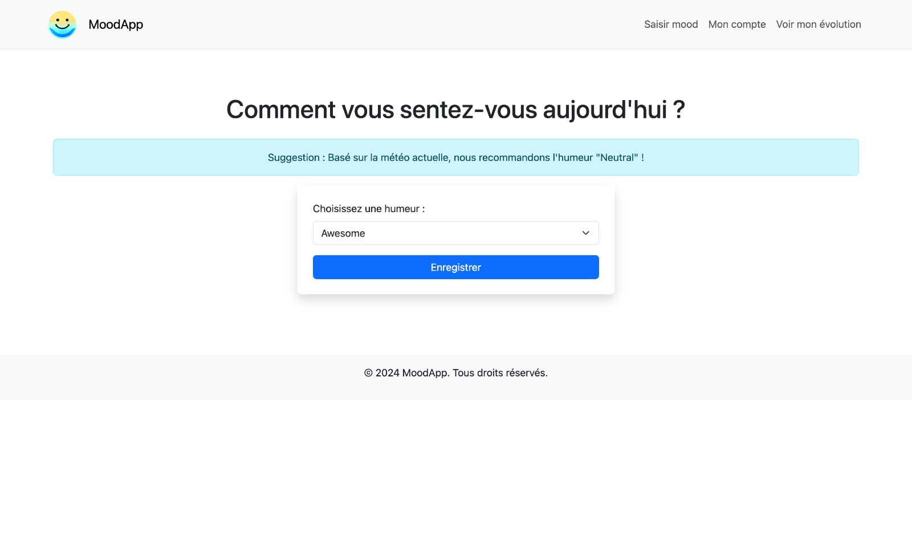
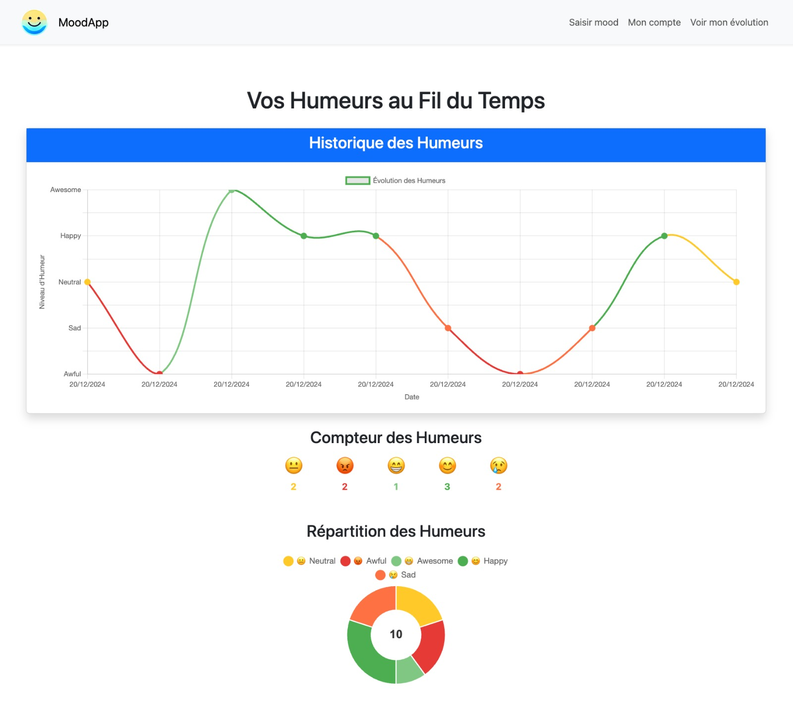
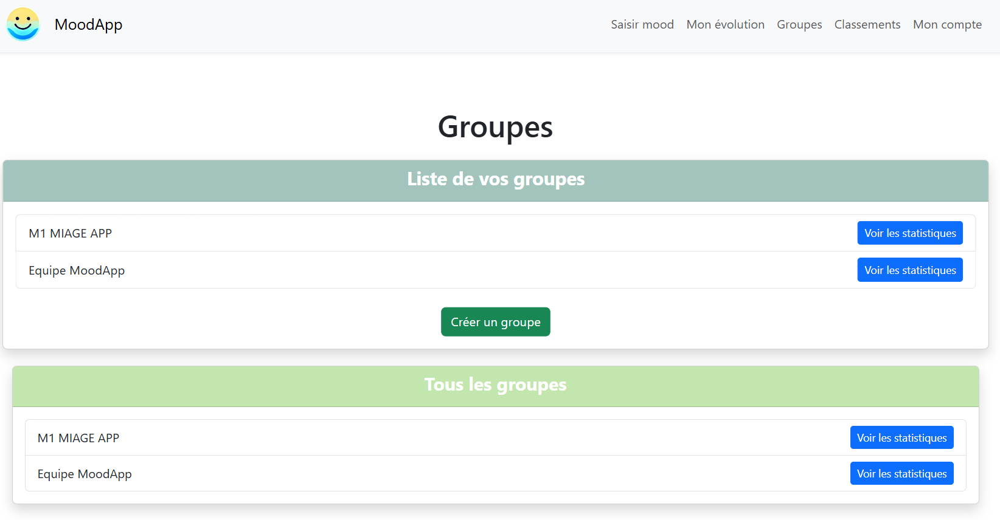
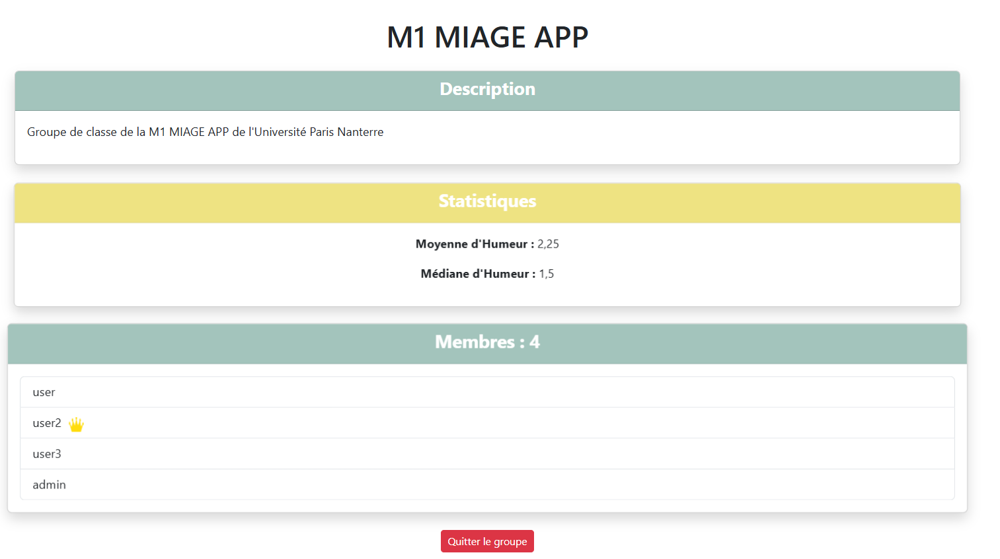
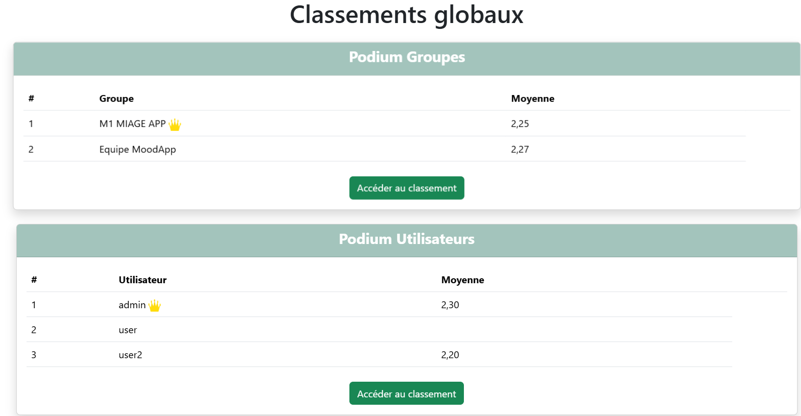
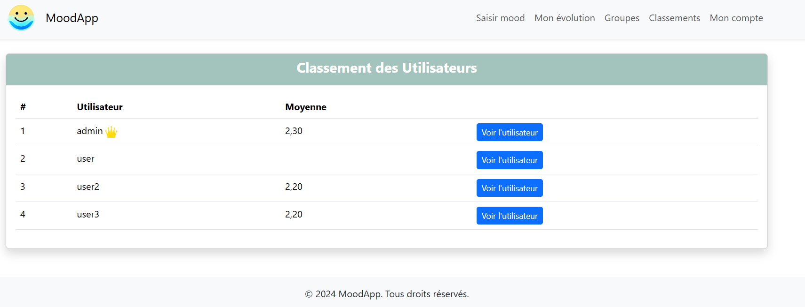
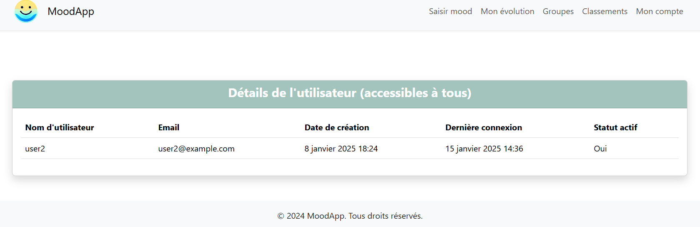
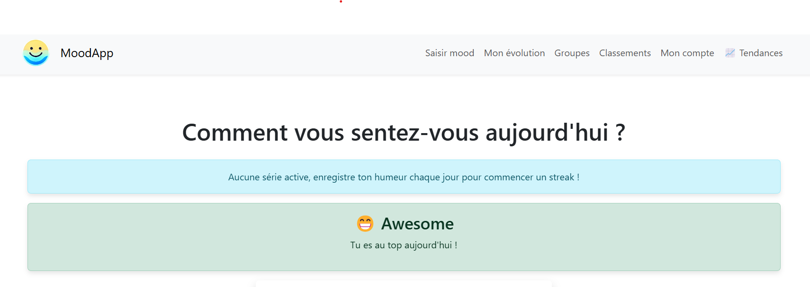
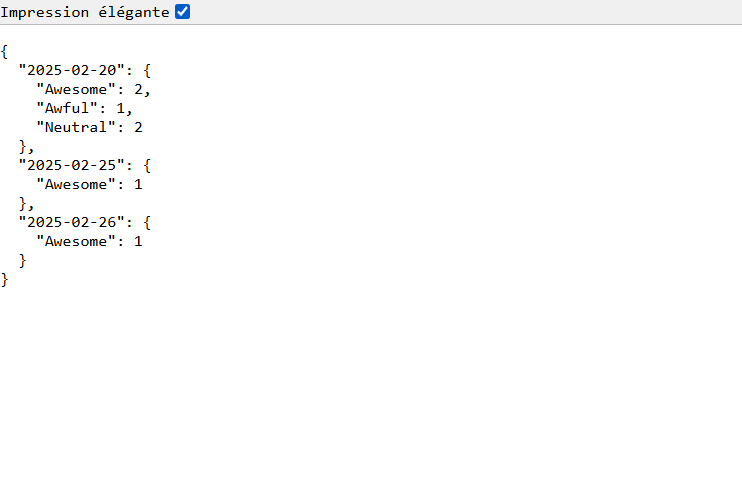

= ```MoodApp``` Documentation

== Neptune MIAGE organization members
Kevin SOARES, Ryad MESSAOUDI, Yassine BENABDELKADER, Romain THOMAS

== App purpose
Here's a quick description about the app purpose, the features available...

MoodApp is an app where you can enter your mood daily, follow precisely the evolution of your mood, get recommandations on your mood based on the day's weather, and more to come... 

== How to install and run project ?

=== Prerequisites
You need Git and Python (or Python3) downloaded on your computer.  

=== Install project 
Use Git to clone the project on your computer.

=== Run project
1. Open terminal  
2. Whether you have a Mac/Linux or a Windows, you should only need to run a script to get started.

See README.md on branch main for commands needed to run the project.

[Access repository] https://github.com/Neptune-MIAGE/BackEnd

== Features description 

=== User's mood addition and visualization
An user can add his mood, going from "awful" to "awesome" (whenever and as much as he wants for now).

A chart is created with the user's moods, showing the evolution of the mood.

There are also smileys counters and a pie chart that show the number and repartition of the previous entered moods.



=== Mood suggestion depending on the wheather
The OpenMeteo API recovers the weather on the user, depending on his location (for now, the default location is Paris).

The user's mood is then suggested, according to the current weather (for example, a rainy weather will suggest a sad mood).

The user can follow or not the mood suggestion when he adds his mood.

The current weather is saved when adding a mood. This will be helpful for improving or creating future features.




=== Users groups
You can create users groups.

Every group has it's own name, description, stats and users list.

The stats calculated for now are the average and median mood of the group.

The group creator is leader by default. The leader can name another member of the group as new leader to replace him, so the ex-leader is now only a member.

You can join or leave a group.

If you're the leader, you have to name someone else leader before leaving.

If there's only one member in the group, leaving the group will delete it.

Screenshot n°1 :



Screenshot n°2 :




=== Users and groups rankings
Users and groups are ranked by their average mood.

There's a podium for users and for groups, displaying the three bests users and the three bests groups.

There is an individual page for the global users ranking, and same for the global groups rankings.

You can access individual pages for each group and user. For the groups, this will take you to the group page (wether you're a member or not). For the users, this will display a "visit card" of the user with some informations about him.

Screenshot n°1 : 



Screenshot n°2 : 



Screenshot n°3 : 




=== Analyse and personnalized advices on mood trends
Objective: Provide intelligent feedback on the evolution of moods with suggestions/actions

What this adds:

Detection of trends (e.g., “You've often been Happy these last few days, keep it up!”)
Analysis of triggers (e.g., “When it rains, you're more often Sad”)
Personalized advice (e.g., “You've had several Sad days in a row, try doing something you enjoy today”)
Visualization with colors/tags (e.g., periods of stress, peaks of happiness, etc.)

Screenshot n°1 : 



Screenshot n°2 : 


