= ```MoodApp``` Documentation

== Neptune MIAGE organization members
Kevin SOARES, Ryad MESSAOUDI, Yassine BENABDELKADER, Romain THOMAS

== App purpose
Here's a quick description about the app purpose, the features available...

MoodApp is a personal emotional tracking application designed to help users monitor, understand, and improve their mood over time. Users can log their mood daily, from “awful” to “awesome,” and visualize its progression through dynamic charts and statistics. The app enhances self-awareness by offering smart mood suggestions based on real-time weather data, using the OpenMeteo API.

To enrich the user experience, MoodApp also integrates the Deezer API, allowing the app to suggest music playlists that match the user's current mood. This musical companion adds a personalized and uplifting touch to each emotional state.

Beyond individual tracking, MoodApp fosters community through user groups. Each group displays mood statistics like average and median values, and allows members to join, leave, or transfer leadership roles. Users and groups are also ranked based on average mood, with dedicated pages and podium displays for top performers.

MoodApp further leverages trend analysis and contextual insights to offer personalized advice, such as highlighting recurring mood patterns or identifying mood triggers like rainy weather. These insights are delivered with encouraging messages and visual cues.

An interactive map, powered by OpenStreetMap, displays each user's mood history as geolocated emojis, providing a fun and spatial view of emotional data. This ensures both privacy and engagement, as users only see their own mood markers.

With its combination of emotional intelligence, weather and music integration, social features, and playful visualizations, MoodApp offers a comprehensive and engaging experience for anyone looking to reflect on and elevate their emotional well-being.


== How to install and run project ?

=== Prerequisites
You need Git and Python (or Python3) downloaded on your computer.  

=== Install project 
Use Git to clone the project on your computer.

=== Run project
1. Open terminal  
2. Whether you have a Mac/Linux or a Windows, you should only need to run a script to get started.

See README.md on branch main for commands needed to run the project.

[Access repository] https://github.com/Neptune-MIAGE/BackEnd

== Features description 

=== User's mood addition and visualization
An user can add his mood, going from "awful" to "awesome" (whenever and as much as he wants for now).

A chart is created with the user's moods, showing the evolution of the mood.

There are also smileys counters and a pie chart that show the number and repartition of the previous entered moods.

Sequence diagramm:

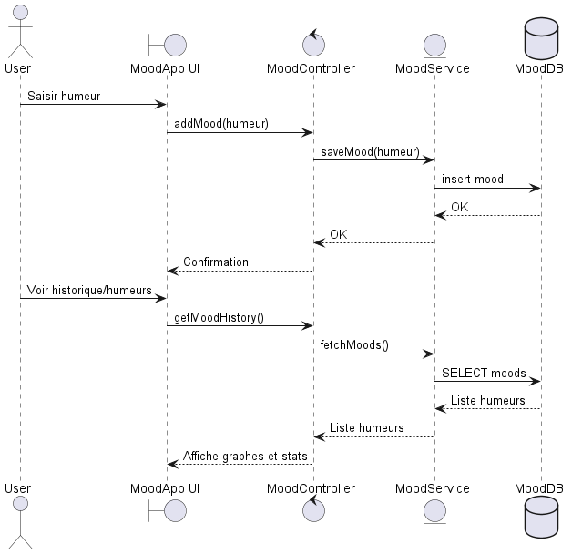

Screenshot:

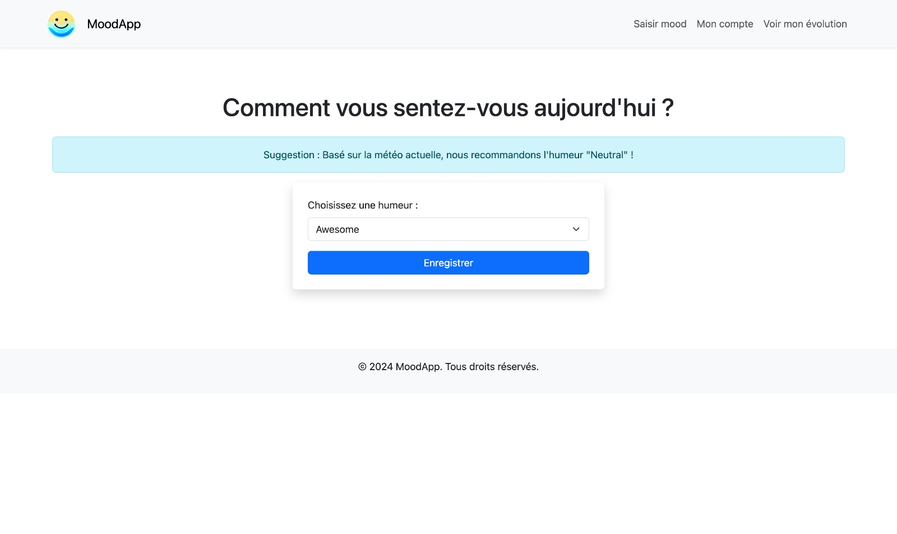

=== Mood suggestion depending on the wheather
The OpenMeteo API recovers the weather on the user, depending on his location (for now, the default location is Paris).

The user's mood is then suggested, according to the current weather (for example, a rainy weather will suggest a sad mood).

The user can follow or not the mood suggestion when he adds his mood.

The current weather is saved when adding a mood. This will be helpful for improving or creating future features.

Sequence diagramm:

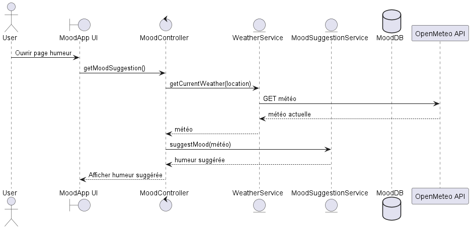

Screenshot:

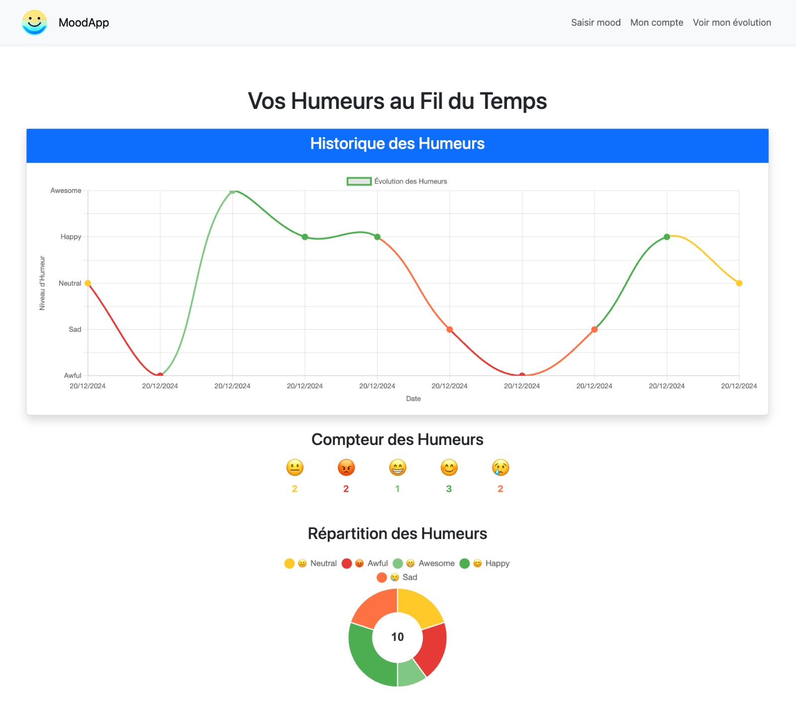


=== Users groups
You can create users groups.

Every group has it's own name, description, stats and users list.

The stats calculated for now are the average and median mood of the group.

The group creator is leader by default. The leader can name another member of the group as new leader to replace him, so the ex-leader is now only a member.

You can join or leave a group.

If you're the leader, you have to name someone else leader before leaving.

If there's only one member in the group, leaving the group will delete it.

Sequence diagramm:

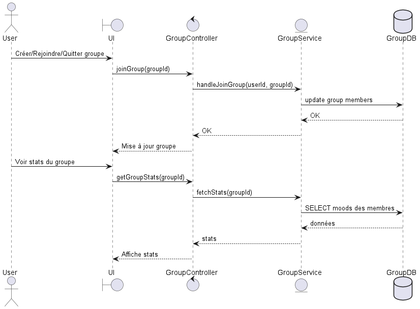

Screenshot n°1 :

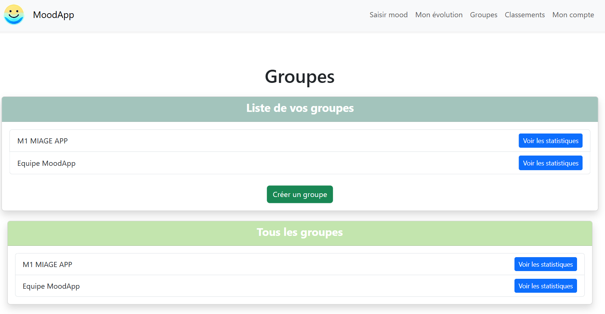

Screenshot n°2 :

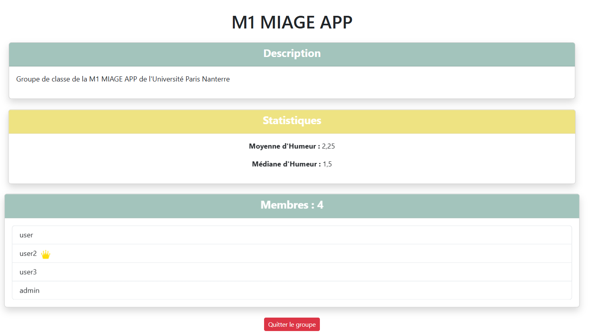


=== Users and groups rankings
Users and groups are ranked by their average mood.

There's a podium for users and for groups, displaying the three bests users and the three bests groups.

There is an individual page for the global users ranking, and same for the global groups rankings.

You can access individual pages for each group and user. For the groups, this will take you to the group page (wether you're a member or not). For the users, this will display a "visit card" of the user with some informations about him.

Sequence diagramm:

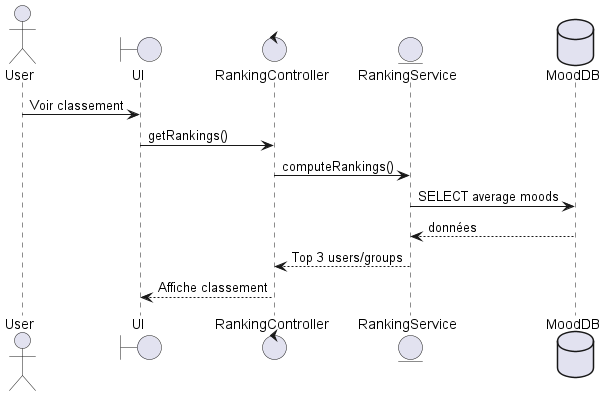

Screenshot n°1 : 

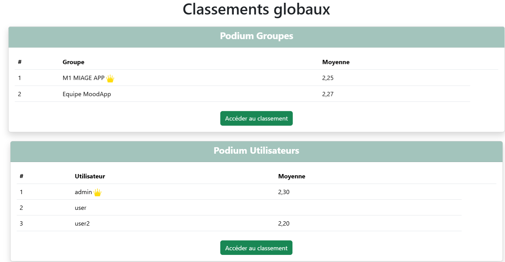

Screenshot n°2 : 

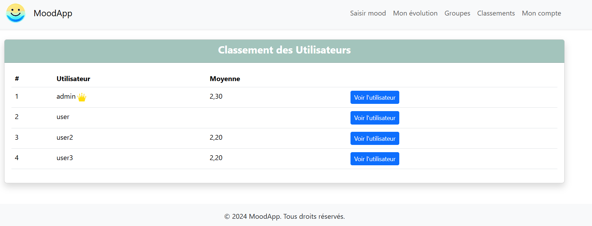

Screenshot n°3 : 

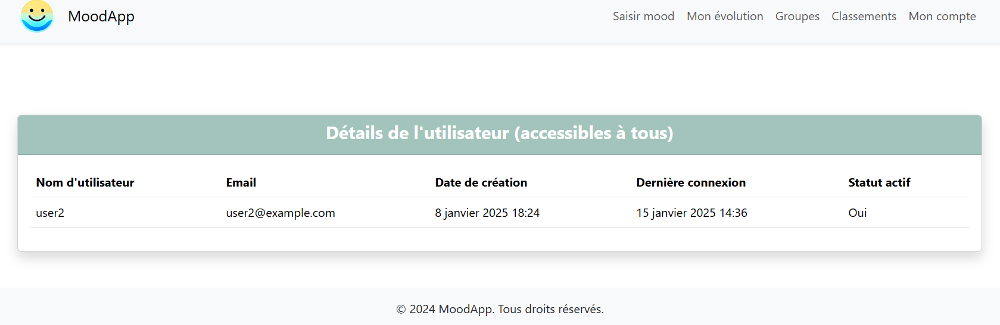


=== Analyse and personnalized advices on mood trends
Objective: Provide intelligent feedback on the evolution of moods with suggestions/actions

What this adds:

Detection of trends (e.g., “You've often been Happy these last few days, keep it up!”)
Analysis of triggers (e.g., “When it rains, you're more often Sad”)
Personalized advice (e.g., “You've had several Sad days in a row, try doing something you enjoy today”)
Visualization with colors/tags (e.g., periods of stress, peaks of happiness, etc.)

Sequence diagramm:

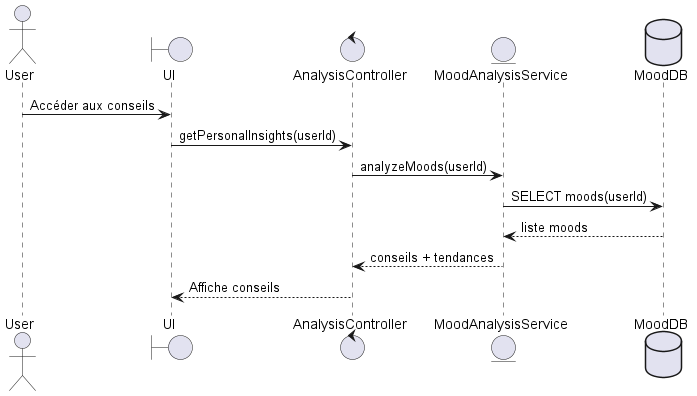

Screenshot n°1 : 

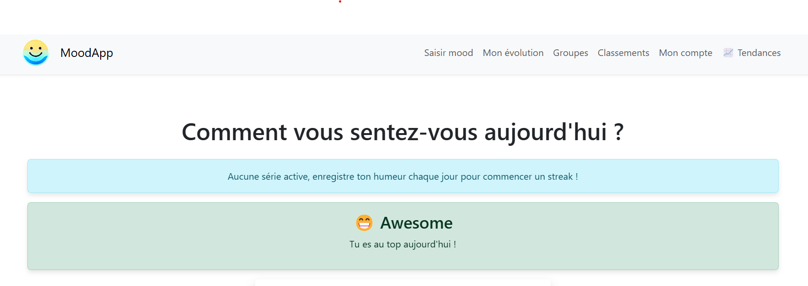

Screenshot n°2 : 

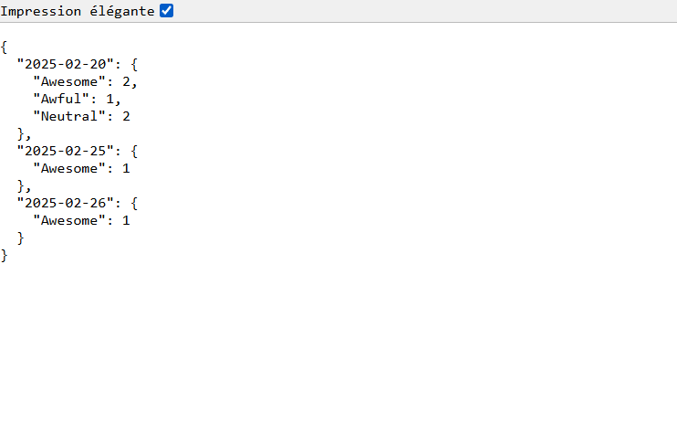


=== Map displaying the submitted moods
This interactive map feature allows each user to visualize their moods as geolocated emojis on an OpenStreetMap API-based interface. Every time a user records a mood through the dedicated form, a corresponding emoji is automatically added at his GPS location (by default, Université Paris Nanterre), with slight variation to prevent overlapping markers. Emojis appear directly on the map as custom icons, replacing the standard blue markers. Each user has their own personal map: only their own mood markers are displayed, ensuring a private and personalized experience. This visual representation adds a playful and engaging layer to emotional tracking while offering a geographic view of moods over time. The map updates dynamically and instantly reflects newly submitted moods.

Sequence diagramm:

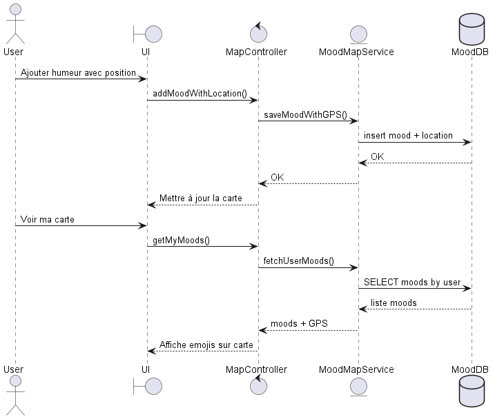

Screenshot n°1 : 

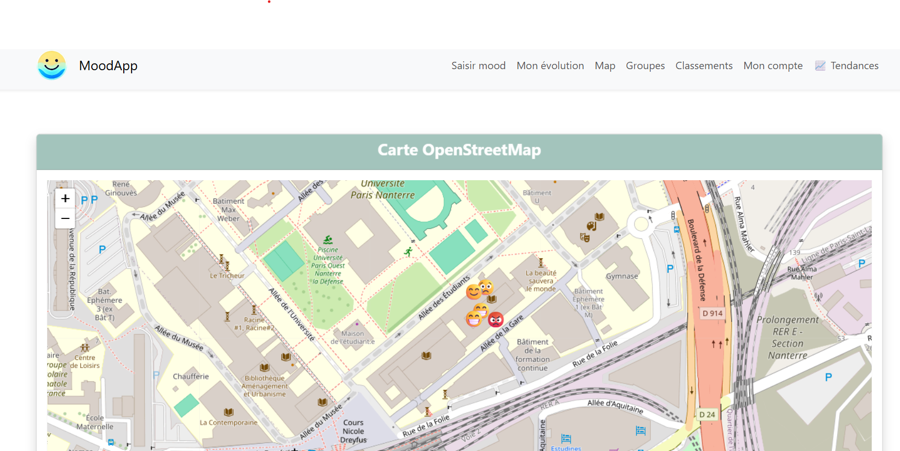

Screenshot n°2 : 

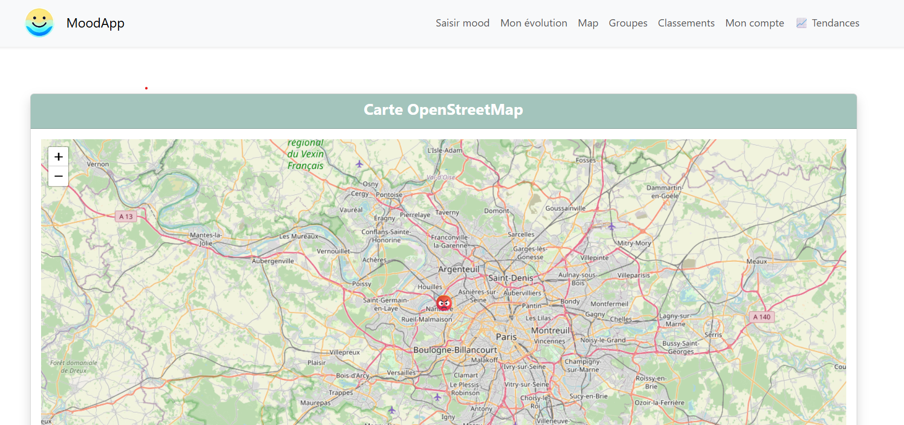


=== Dynamic playlist depending on the modd
Dynamic retrieval of music playlists is performed based on the user's current mood. A built-in player is integrated using the Deezer widget, allowing users to listen to suggested tracks directly within the app. This feature enhances the MoodMap experience by adding a personalized musical atmosphere tailored to the user's emotional state.

Screenshot n°1 : 

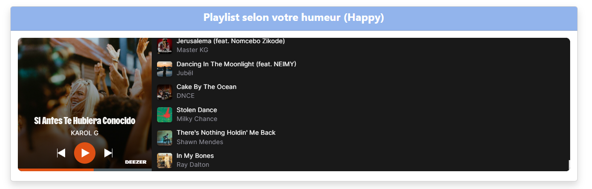

Screenshot n°2 : 

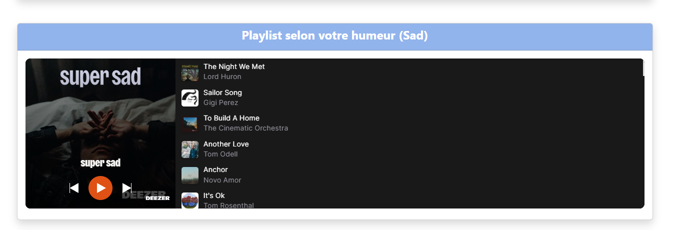